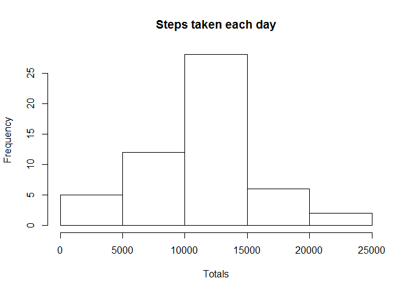
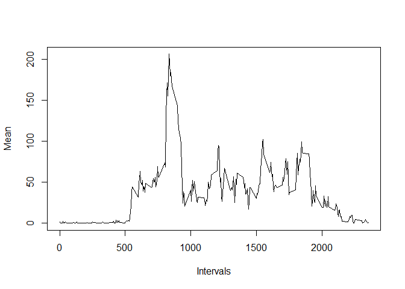
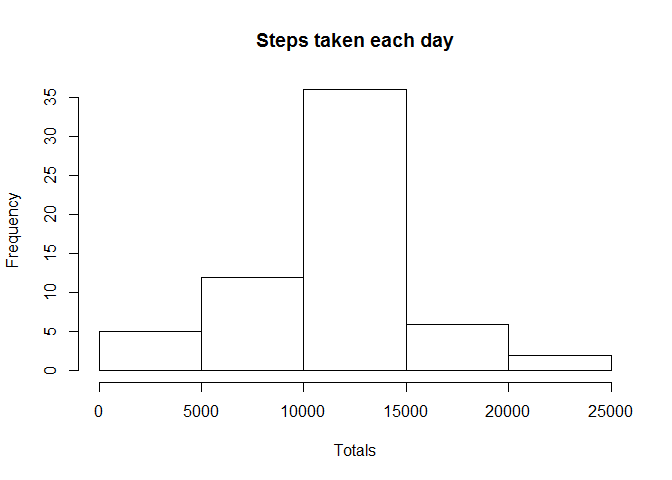
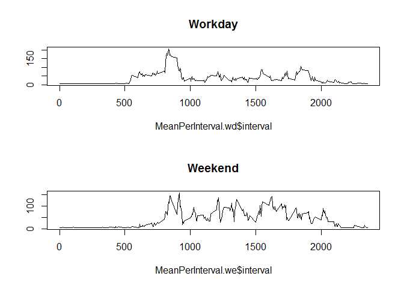

# Reproducible Research: Peer Assessment 1


## Loading and preprocessing the data

Read the activitis from csv file. Make sure to overwrite your wd if reproducing the code!


```r
setwd("C:/R/Data Science Tracks/Reproducible")
Dta <- read.csv("activity.csv")
```


## What is mean total number of steps taken per day?

Use library dplyr to manipulate the data set

```r
library(dplyr)
```

```
## Warning: package 'dplyr' was built under R version 3.1.3
```

```r
# total number of steps
CleanDta <- mutate(Dta, date = as.Date(as.character(date)))
GroupByDay <- group_by(CleanDta, date)
TotalPerDay <- summarize(GroupByDay, Total =sum(steps))


## histogram of total number    
hist(TotalPerDay$Total, main = "Steps taken each day", xlab="Totals")
```

 

```r
## mean 
MeanTotals <- as.integer (   round(  mean(TotalPerDay$Total, na.rm=TRUE) )    )

## Median
MedianTotals <- median(TotalPerDay$Total, na.rm=TRUE)
```

The mean is 10766 and Median is 10765


## What is the average daily activity pattern?
Use the clean data set from above (ClnDta) and build the summarized 5-min intervall


```r
## average daily activity
GroupByInterval <- group_by(CleanDta, interval)
MeanPerInterval <- summarize(GroupByInterval, Mean =mean(steps, na.rm=TRUE))

## plot time series
plot(MeanPerInterval$interval, MeanPerInterval$Mean, type = "l", 
     xlab="Intervals", ylab = "Mean")
```

 

```r
## max interval
MaxSteps <- max(MeanPerInterval$Mean)
MaxInterval <- MeanPerInterval[which(MeanPerInterval$Mean == MaxSteps ),]
```

The MAX interval is 835

## Imputing missing values

```r
x <- Dta[,1]
missingValues <- length(x[is.na(x)])
```

The number of missing values is 2304

Overwrite NAs with overall mean and create new DS CleanDta.1

```r
CleanDta.1 <- CleanDta
## overall mean
MeanTotals <- mean(Dta[,1], na.rm=TRUE)
CleanDta.1$steps[is.na(CleanDta.1$steps)] <- MeanTotals


## use new ds and create histogram and new mean and median

GroupByDay.1 <- group_by(CleanDta.1, date)
TotalPerDay.1 <- summarize(GroupByDay.1, Total =sum(steps))


## histogram of total number    
hist(TotalPerDay.1$Total, main = "Steps taken each day", xlab="Totals")
```

 

```r
## mean and median
##x <- CleanDta.1$steps
newMean <- as.integer (  mean(TotalPerDay.1$Total, na.rm=TRUE)   )
newMedian <- as.integer(   median(TotalPerDay.1$Total, na.rm=TRUE)  )
```
The new mean is 10766 and new median is 10766. Reason for this is the very
poor methode here to overwrite NAs.


## Are there differences in activity patterns between weekdays and weekends?


```r
## weekdays vs workdays
wd <- weekdays(CleanDta.1$date)
CleanDta.1 <- cbind(CleanDta.1, wd)

CleanDta.1 <- mutate(CleanDta.1, Weekend = (wd == "Sunday" ) | (wd == "Saturday")  )

WD <- CleanDta.1[which(CleanDta.1$Weekend == FALSE ),]
WE <- CleanDta.1[which(CleanDta.1$Weekend == TRUE ),]


## average daily activity
GroupByInterval <- group_by(WD, interval)
MeanPerInterval.wd <- summarize(GroupByInterval, Mean =mean(steps, na.rm=TRUE))

GroupByInterval <- group_by(WE, interval)
MeanPerInterval.we <- summarize(GroupByInterval, Mean =mean(steps, na.rm=TRUE))

## plot time series
par(mfrow = c(2,1))
plot(MeanPerInterval.wd$interval, MeanPerInterval.wd$Mean, type = "l",ylab=""
     ,main = "Workday")

plot(MeanPerInterval.we$interval, MeanPerInterval.we$Mean, type = "l", ylab=""
     ,main = "Weekend")
```

 


Plots are showing more activities during the weekend. But higher activities are done
during the weekdays.
